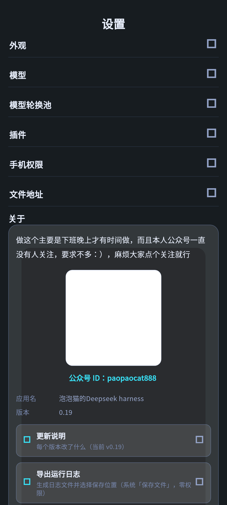
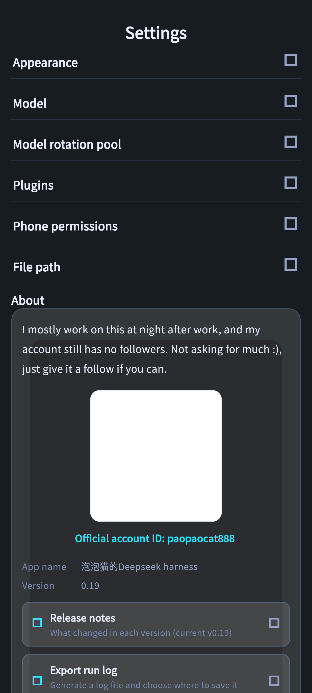
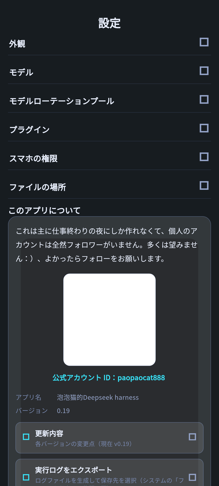
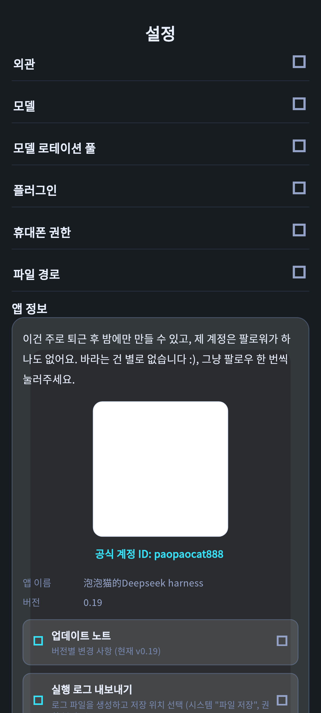
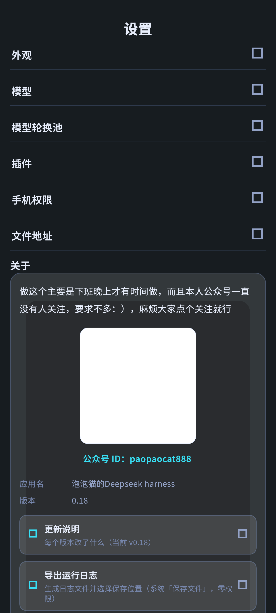
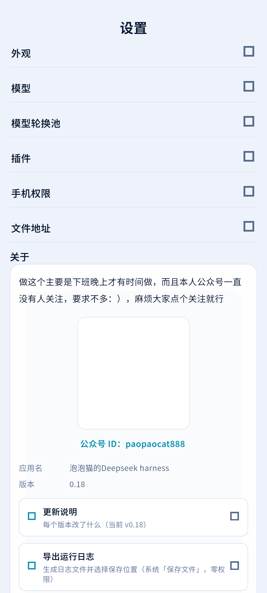
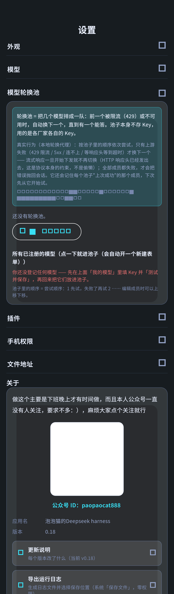

# paopaocat deepseek harness-mobile

[中文](README.md) · [English](README.en.md) · [**日本語**](README.ja.md) · [한국어](README.ko.md)

> スマホの中の DeepSeek Harness —— DSH ランタイム一式を Android に丸ごと収めました。機能もファイルシステムも完全に、すべてあなた自身のスマホの中にあります。モデルを呼び出す工程を除けば、どのサーバーにも依存しません。

<div align="center">
  <b style="font-size:1.15em;">ポケットの中の完全な DSH：オフラインで使えて、ひとことで本物のファイルが手に入る</b><br><br>
  <a href="https://github.com/zmm863-commits/paopaocat-deepseek-harness-mobile/releases"></a>
  <a href="https://github.com/zmm863-commits/paopaocat-deepseek-harness-mobile/stargazers"></a>
  <a href="https://opensource.org/licenses/MIT"></a><br><br>
  
  
  
  
</div>

## 📑 目次
- [✨ 機能一覧](#-機能一覧)
- [🚀 インストール](#-インストール)
- [🖼️ スクリーンショット](#スクリーンショット)
- [💬 コミュニティ](#交流とフィードバック)
- [🆕 最近の更新](#-最近の更新)
- [⚠️ 既知の制限](#既知の制限)


## ✨ 機能一覧

> 本アプリの機能一覧は、下の「なぜそれが強みなのか」と「12 組の内蔵セッション」の 2 節をご覧ください。

## 🚀 インストール

DSH は、ローカルマシン上で動かせる AI Agent ランタイムです。ファイルの読み書き、タスクの実行、ツールの呼び出し、複数ターンのコンテキストの維持ができます。

このアプリがやっているのは、**DSH ランタイム一式をそのまま Android アプリに詰め込むこと**です——Node ランタイムとすべての依存関係を内蔵し（`libnode.so` 49MB + `dsh-runtime.zip` 157MB、カーネルは `@deepseek-ai/dsh 0.1.7-rc.2`）、初回起動時にアプリのプライベートディレクトリへ自動で展開します。その後は**完全にオフラインで動作**します（モデルと会話するときだけネットワークにつながります）。

ウェブのラッパーでも、リモートデスクトップでもありません。ネットワークを切っても、画面も履歴もファイルも、あなたのスマホの中にそのまま残っています。

- パッケージ：`paopaocat-preview-0.20-arm64-v8a.apk` · 208.8MB · arm64-v8a · minSdk 24 · **versionCode 20 / versionName 0.0.20**
- 中核：Flutter + Node · 専門家 321 名 / 22 部門 · **12 個のスキル**（make-image / make-video / make-slides / code-tool / data-analysis / doc-digest / doc-processing / file-organize / sheet-cleanup / study-cards / translate-polish / weekly-report + android-exec-shim + rotate-proxy）
- 外観：ダーク/ライトの 2 テーマをワンタップで切り替え、再起動後も維持されます。**UI 言語は切り替え可能（中文 / English / 日本語 / 한국어）**。カスタム配色はプレースホルダーの説明で、存在しない状態に切り替わることはありません
- プライバシー：API Key は Android Keystore にのみ保存され、セッションと生成物はプライベートディレクトリにあります。実行前にはあなたの確認が必要です

## インストール

- arm64 の実機、提供元不明のアプリのインストールを許可しておくこと
- インストール後の初回起動でランタイムを展開します（約 30 秒）。その後はオフラインで使えます
- arm64-v8a の単一アーキテクチャのパッケージのみで、x86/armeabi の端末には対応していません
- **アップグレードにアンインストールは不要**：0.19 は 0.14 と同じ証明書で署名されており（デバッグ証明書 `7aaf4448…d3cc17`）、versionCode も増えているので、**そのまま上書きインストールでき、セッション / ファイル / Key は失われません**

```sh
# 校包体
sha256sum paopaocat-preview-0.20-arm64-v8a.apk
# 预期: 24c8878f0b666570e52b383c39bb317fea88fea831bdcf9c3619b76db94b44bf
```

## クイックスタート

1. **モデルを設定**：設定 → DeepSeek 公式 / Command / LongCat / MiMo を選ぶ（エンドポイントは入力済み）→ Key を入力 → **モデルを取得**（複数選択可）→ チェック → **テストして保存**（実際に最小の会話を投げ、成功したときだけ準備完了と表示されます）。レート制限対策が必要なら**モデルローテーションプール**を作れます（複数のモデルを順に試し、429 なら自動で次に切り替え。詳しくは後述）
2. **セッションを開始**：ホームで **新しいセッションを開始** → 要望を入力 → ストリーミングの表示、ツール呼び出しカード、生成物カードを確認。**中断/再開**もできます
3. **専門家とスキルを使う**：専門家センターで必要な専門家をオンにし（スイッチは実際にランタイム設定へ書き込まれます）→ セッションに戻って要望を出します。モデルに直接「スキルを一つ作って」と頼むこともできます
4. **画像/動画/PPT を作る**：モデルに「画像を一枚生成して/動画を作って/PPT を作って」と伝えると、`make-image.mjs`（テキストから画像/画像から画像/複数画像の合成、1K-4K、8 種類の比率、現在は無料）/`make-video.mjs`（テキストから動画/先頭・末尾フレーム、4-12 秒）/`make-pptx.mjs`（本物の .pptx、表紙+要点+ノート）を呼び出して、**実体のあるファイル**をワークスペースに生成します。Key を設定していないと中国語のエラーが出て、登録先のアドレスが表示されます
5. **ファイルを受け取る**：セッションの生成物は自動で **ライブラリ** → **ワークスペース** に入り、複数のディレクトリを並行して扱えます。定期実行が必要ならタスクを作成（毎日/平日/毎週/1 回のみ）し、時刻になると自動で実行されます（常駐通知に依存するため、中国製 ROM の省電力ポリシーの影響で「見送り」と表示されることがあります）
6. **添付ファイルと 12 組の内蔵セッション**：撮影（システムカメラ → プライベートディレクトリ）/ アルバムから画像・動画を選ぶ / 任意のファイル（実際のパスを渡せばモデルが読み取れます）/ 音声（システムの認識を利用）。ホームの **12 件の内蔵セッションにはそれぞれ 1 つのスキルが紐づいており**、一度に 4 件を表示します。**入れ替え**をタップすると 3 組すべてを確認できます

**12 組の内蔵セッション × 12 個のスキル（ホームの入れ替えですべて表示、各項目をタップするとすぐにセッションが開きます）**

| # | セッション入口（ホーム） | 裏側のスキル | ひとことでできること |
|---|---|---|---|
| 1 | 画像を 1 枚生成 | `make-image` | テキストから画像/画像から画像/複数画像の合成、1K-4K、8 種類の比率、Agnes は無料 |
| 2 | 動画を 1 本生成 | `make-video` | テキストから動画/先頭・末尾フレーム、4-12 秒、非同期ポーリング |
| 3 | PPT を 1 本作る | `make-slides` (`make-pptx.mjs`) | 本物の .pptx（16:9、表紙+要点+ノート） |
| 4 | 小さなツールを書く | `code-tool` | 自己完結した単一の .mjs、Node 標準モジュールのみ、その場で動作確認 |
| 5 | データを分析 | `data-analysis` | CSV/JSON を実際に計算し、Markdown レポート + オフライン HTML グラフを生成 |
| 6 | 表をクリーンアップ | `sheet-cleanup` | 汚れた CSV の重複排除/形式統一/フィールド補完/グループ集計、clean-*.csv として別名保存 |
| 7 | 長文を速読 | `doc-digest` | 長文を要点/タイムライン/重要数値の速読用原稿に圧縮 |
| 8 | 文書を処理 | `doc-processing` | 要約/書き換え/誤り訂正/Markdown・HTML への変換、新しいファイルを生成 |
| 9 | ファイルを整理 | `file-organize` | まず案を出して確認を待ち、その後にアーカイブ/一括リネーム、元に戻せます |
| 10 | 学習カードを作る | `study-cards` | 教材を問答カードに変換し、Markdown + インポートできる CSV を生成 |
| 11 | 翻訳と推敲 | `translate-polish` | 中国語と英語の相互翻訳/推敲、対訳の Markdown を生成 |
| 12 | 週報を書く | `weekly-report` | ワークスペースの新規/変更ファイルを走査し、パス付きの週報にまとめます |

> ホームには一度に 4 件が表示され、**入れ替え**をタップすると 1 組まるごと切り替わります。3 回タップすると 12 件すべてを確認できます。各項目には対応するスキルが紐づいており、開くとその文脈を持った状態でセッションが始まります。

## 🆕 0.20 アップデート · スマホ単体で大規模モデルを実行（オフライン対応）

- **スマホ単体で大規模モデルを実行（オフライン対応）**：モデルファイルをアプリに入れると、DSH のモデル一覧に `local` という提供元が増えます。推論はすべて端末内で行われるため、**機内モードでも会話できます**。
- **2 つのバックエンドを切替可能＋ワンタップ計測**：既定は GPU（Vulkan）、「CPU のみ」にも戻せます。【計測】を押すとこの端末の生成速度（tok/s）と初回トークン遅延が出ます。
- **モデルの入手は 2 通り**：① アプリ内ダウンロード（12 件のモデル一覧を内蔵、中国本土の主要ミラーで実測 4–5 MB/s、複数ソースから最速を自動選択＋レジューム対応）；② ローカルファイルから取り込み（クラウドストレージ / WeChat / USB ケーブル、**複数選択可**、ストレージ権限は不要）。
- **入れたものは検証を通す**：ファイルサイズを検証し、sha256 を記入後はバイト単位で検証します。検証に通らないファイルは「インストール済み」として登録されません。
- **境界を正直に明示**：オンデバイス推論には **Android 9 以上**が必要です。メモリに収まらないモデルは必要 GB 数を表示します。モデルファイルは同梱しません（アプリは引き続き 200 MB 台）。

## 🕘 0.19 アップデート · UI 言語を切り替え可能（中 / 英 / 日 / 韓）

**「設定 → 外観」に「言語」を新設**：中文 / English / 日本語 / 한국어 の 4 つのボタンがあり、タップすると画面が**すぐに**切り替わり、再起動後も維持されます。

- **アプリ自身が描画する画面はすべて 4 言語に対応**：下部ナビゲーション、設定画面の 6 つのセクション、ボタン、空状態のヒント、内蔵のエラー説明と次の一手の提案 —— **738 件**の UI 文言すべてに英 / 日 / 韓の訳文があります
- **PC 側の DSH が返す内容は原文のまま**：セッションのメッセージ、スキル名、321 名の専門家、バックエンドのエラーはすべて PC 側から返されるもので、アプリが代わりに言語を決めることはありません。この境界は「外観 → 言語」の下に明記してあり、作りかけではありません
- **言語ボタンにはそれぞれの母語名を表示**：画面をすでに日本語に切り替えていても、韓国のユーザーが一目で「한국어」を見つけられます
- **リポジトリの説明とスクリーンショットも 4 言語に対応**：このドキュメントには [`English`](README.en.md) · [`日本語`](README.ja.md) · [`한국어`](README.ko.md) の 3 バージョンがあります

項目ごとの説明は [`docs/changelog-0.19.md`](docs/changelog-0.19.md) をご覧ください。

## 🆕 0.18 アップデート（0.15 → 0.18 · 25 項目）

パッケージ `paopaocat-preview-0.18-arm64-v8a.apk` · 188MB · **versionCode 18 / versionName 0.0.18**、署名は 0.14 と同じデバッグ証明書（`7aaf4448…d3cc17`）で、**そのまま上書きインストールでき、データも失われません**。
項目ごとの説明は [`docs/changelog-0.18.md`](docs/changelog-0.18.md) をご覧ください。以下はバージョンごとの要約です（内容はアプリ内の「設定 → について → 更新内容」`app/lib/data/changelog.dart` から取得し、項目ごとに対応させたもので、余計な脚色はありません）。

### 0.15（11 項目）· 機能を作る

- **音声入力が初めて本当に使えるようになりました**：以前の「押して話す」は**指を離した後**に録音を始めていました —— スマホに向かって話している間ずっと録音されておらず、無音を拾うので必ず失敗し、マイクの権限をどう設定しても無駄でした。今は押した瞬間から聞き取り、離すと止まります
- **会話をコピーできます**：ユーザーのメッセージやアシスタントの返信を長押しすると選択・コピーできます
- **左右スワイプでページを切り替え**（ホーム / 専門家 / ライブラリ / 定期タスク / 設定）。最も端の 24 ピクセルは反応しません。システムの端からの戻るジェスチャーとぶつからないようにするためです
- **セッションの名前を変更できます**：ワークスペース画面でそのセッションを長押しすると名前を付けられます（名前は本アプリにのみ保存され、ACP プロトコルには名前変更機能がないため DSH 側は影響を受けません）
- **「スマホの権限」セクションを新設**：マイク / 位置情報 / アルバム / 通知が現在許可されているかが分かり、タップするとシステムの許可ダイアログが開きます。「すべてのファイルへのアクセス」のような特殊な権限の入口もまとめました（Android に「全権限を一括で開く」機能はないため、特殊な権限はご自身でシステムの画面から許可する必要があります）
- **画像が本当に理解できるようになりました**：以前は画像を送ってもパスをモデルに渡すだけで、テキスト専用のモデルは「画像は見えません」と答えるしかありませんでした。今は**無料の視覚チェーン**を内蔵し（Key は一切不要）、画像を自動でテキストの説明に変換してからモデルに渡します。⚠️ 画像はサードパーティのサービスにアップロードされるため、機密性の高い内容はこの経路を使わないでください
- **セッションで生成したファイルが残り、どのセッションで生成したかも分かります**：以前はセッションを抜けて入り直すと生成物リストが空になっていました
- **長いセッションのアシスタント**（入力欄の左の ＋ メニュー）：現在のコンテキストをどれだけ使ったかを推定し、ワンタップで「引き継ぎノート」を生成して入力欄に挿入、新しいウィンドウで作業を続けられます
- **別のページに移動しても回答が中断されなくなりました**：セッションのプロセスはアプリが一括で管理するため、ライブラリを見に行ったり設定を変更したりしても、生成中の回答は最後まで続きます。ホーム上部に「セッション名（回答中）」が表示され、タップするとそのセッションに直接戻れます
- **複数のセッションを同時に開けます**：前のセッションがまだ動いていてもホームに戻って新しく開くことができ、それぞれ互いに干渉しません
- 背景のグリッド線を明るくしました（元は不透明度 3.5% しかなく、見えないのと同じでした）

### 0.16（6 項目）· 実測フィードバックに基づく修正

- **「モデルにファイルを生成させたのに、生成物に見当たらない」を修正**：2 つのバグが重なっていました —— ① ファイル名を認識するルールが**絶対パスの先頭の `/` を食ってしまい**、ファイルは相対パスとして探され、永遠に見つからず黙って捨てられていました。② ツールが**完了**した瞬間の通知にはパラメータが含まれなくなり、アプリは以前**開始**時の通知から「コマンド」という 1 つのフィールドしか取っていなかったため、「ファイル書き込み」のようなツールの対象パスがそのまま失われていました。どちらも修正し、リグレッションテストで固定しました
- **グリッド線を撤去し、背景全体を一段明るく**：今は線が一切なく、上から下へ淡く広がる柔らかな光が一層あるだけです。ベースの色もどちらかといえば真っ黒だったところから一段明るくしました（真っ黒ではなく限りなく黒に近い色を使い、テクスチャを貼るのではなく明度で階調を作っています）
- **「長いセッションのアシスタント」パネルを不透明の単色に変更**：以前は半透明で、背後の内容と混ざって文字が読みにくくなっていました
- **設定画面の「モデル / スマホの権限 / ファイルの場所」を折りたたみ式に**：見出しをタップすると展開します（矢印がくるっと回ります）。たたむと 1 画面に収まって全体が見えます
- **音声の「固まって何も出ない」2 か所を追加修正**：① デバイス側の認識が**同期的にエラー**を返したとき、以前はそのまま「認識できませんでした」として返していましたが、今は「認識失敗」と同じように統一してシステムの認識へ**自動フォールバック**します。② 認識できないときは**デバイスの能力**も併せて調べて知らせるようになり、曖昧な「認識できませんでした」の一言で終わりません
- **「音声入力」のセルフチェックを新設**（設定 → スマホの権限 → 音声入力）：このスマホに使える認識サービスがあるか、デバイス側のオフライン認識に対応しているか、認識を処理できるアプリがいくつあるかを直接表示します

### 0.17（3 項目）

- **設定画面の 6 つのセクションをすべて折りたたみ式に**（外観 / モデル / プラグイン / スマホの権限 / ファイルの場所 / について）：開くと 6 行の見出しだけが並び、タップした行だけが展開します
- **各項目名を太字かつ大きめに**：内容が既定でたたまれると、項目の行がこのページ唯一の視覚的な手がかりになります。文字が小さいと「見出し」ではなく「説明文」に見えてしまいます
- 展開の矢印はタップしたときに**くるっと回ります**（瞬間的な切り替えではありません）。今たたまれているのか開いているのかが一目で分かります

### 0.18（5 項目）· 本バージョン

- **左右スワイプが「瞬間的なページ送り」ではなく「指に追従するページ送り」になりました**：指でドラッグするとページがついてきて、離すと慣性で目的のページに弾みます（アニメーション付き）
- **「最後のページまでスワイプしないと 2 回スワイプで終了できない」を修正**：追従するページ送りが画面の最も端のスワイプまで奪ってしまい（そこは本来システムの戻るジェスチャーに属する領域です）、その結果、途中のページでは端からスワイプしてもページが切り替わるだけになっていました。**今は左右それぞれ 32 ピクセルをページ送りが反応しない領域として確保**し、端からのスワイプはこれまでどおり「戻る」になります
- **「について」は折りたたみに入れず、常に開いたまま**：ここには WeChat 公式アカウントの QR コードや連絡先など、「ひと目で見てほしい」ものが入っているためです
- **「ローテーションプール」を「モデルローテーションプール」に改称し、独立したセクションに**：以前は「モデル」の中に縮こまっていて、モデルを展開して下までスクロールしないと見えませんでした。今は「モデル」と並列にあり、そんな機能があることが一目で分かり、単独で展開もできます
- 残りの 5 つのセクション（外観 / モデル / プラグイン / スマホの権限 / ファイルの場所）は折りたたみ式のままです。「について」の項目名はそれらと**同じスタイル**（太字かつ大きめ）なので、見た目は依然としてひとまとまりに見えます

### 0.14 以前

0.14 の 36 項目の項目別の説明は [`docs/emergency-update-0.14.html`](docs/emergency-update-0.14.html)（36 項目を一つずつ列挙）と [`docs/preview.md`](docs/preview.md) をご覧ください：生成ファイルの利用可否 (1-5)、生成物は本物のファイルのみ (6)、モデルと Key (7-19)、画面 (20-26)、セッションと日常 (27-34)、音声 (35-36、一部は未修正)。

> 音声のローカルモデルを内蔵していない理由：DSH 付属の音声モデルは macOS/Linux/Windows のネイティブライブラリしか提供しておらず、Android の bionic はサポート対象外です。さらに int8 モデルは 239MB あり、パッケージに詰め込むのは現実的ではありません。0.15–0.18 の音声機能は**システムの認識サービス + デバイス側のオフライン認識（Android 12+）**で実現しています。0.16 で追加された音声のセルフチェックが「利用できる音声認識サービスがありません」と表示する場合、スマホのシステムに認識サービスが入っていないということなので、音声アシスタント系のアプリをご自身でインストールするか、文字入力に切り替えてください。

### モデルローテーションプール（複数の無料モデルを束ねて、レート制限に強い 1 つのモデルにする）

アプリ内の **設定 → モデルローテーションプール**（0.18 から「モデル」から独立し、「モデル」と並列になりました）では、複数のモデル（各社の無料枠モデルなど）を**順番に 1 つのグループとして束ね**、**グループ名をモデル名として**会話できます：

- 仕組み：ローカルの `rotate-proxy.mjs`（Node 標準モジュールのみ、サードパーティ依存なし）が `127.0.0.1:39321` で OpenAI 互換のプロキシを起動し、グループ内の順番に 1 つずつ試します。**429 のレート制限 / 500 / 接続失敗**のときは自動で次に切り替わり、クライアントからは成功した 1 回の応答だけが見えます
- スティッキー：各グループの**直近で成功したメンバー**を記憶し（`lastGood`、メモリ + 設定への書き戻し）、次回はそこから開始し、失敗すればさらに次へ回ります
- 公開エンドポイント：`GET /health`、`GET /v1/models`（グループごとに 1 つのモデル）、`POST /v1/chat/completions`（グループ名でもメンバーの実際のモデル名でもマッチし、`rotate/cat` のような前後に文字を付けた書き方にも対応）
- ストリーミングの制約（HTTP プロトコル上の制約）：メンバーを切り替えられるのは、**まだクライアントに 1 バイトも送っていない**ときだけです。一度 SSE のパイプを始めてしまうと切り替えられません（その状態で途中切断が起きた場合は、今回の応答を終了してログに記録するだけになります）
- 典型的な使い方：DeepSeek 無料、Qwen 無料、MiMo 無料などを同じグループに入れておけば、日常の会話はグループ名で行い、枠やレート制限は自動でカバーされ、手動で切り替える必要はありません

## 既知の制限

- バックグラウンドの常駐通知はシステムの省電力ポリシーに依存し、一部の中国製 ROM では依然としてプロセスが終了されます。見送られたタスクは正直に「見送り」と表示されます（実行したふりはしません）
- arm64-v8a の単一アーキテクチャのみ、1 パッケージ 208.8MB
- プラグインのインストールはまだ公開していません（安全検証とロールバックの仕組みを先に完成させる必要があります。設定 → プラグインのページに正直に記載しています）
- 音声のローカルモデルは内蔵していません（理由は前述）。認識精度はシステムのオフラインモデル／認識サービスに依存します

## なぜそれが強みなのか（全機能を掲載、弱点も隠しません）

| 観点 | 強み |
|---|---|
| **本物のローカルランタイム** | ウェブのラッパーやリモートデスクトップではありません。`libnode.so` + `dsh-runtime.zip` を APK に丸ごと収めており、初回展開後はオフラインで使えます。画面/履歴/ファイルはすべてプライベートディレクトリにあります |
| **ファイルは本物** | ライブラリは mtime とディレクトリの 2 つのビューで表示され、ワークスペースはそのまま実際のディレクトリです。複数のワークスペースを並行しても互いに干渉せず、生成物は二重のゲートで偽ファイルを防ぎ、生成物はそのまま表示/共有できます |
| **添付はシステム標準の機能を使用** | 撮影はシステムカメラを起動、アルバムから画像・動画を選択、任意のファイルには実際のパスを渡し、音声はシステムの認識を利用します。「アップロード成功」のような偽の表示は出さず、理解できるかどうかはモデルの視覚能力次第であることを正直に説明します |
| **321 名の専門家が実際に効く** | 22 部門のスイッチは `$DSH_HOME/AGENTS.md`（agent-instructions チャネル）に書き込まれ、モデルはペルソナどおりに実行します。スキルは新規作成も、会話から生成することもできます |
| **定期実行は本物の定期実行** | 毎日/平日/毎週/1 回。時刻になると会話と同じチャネルを再利用して実行し、成功/失敗/見送りを記録します。実行したふりはしません（常駐通知に依存） |
| **モデル接続が一番手軽** | 4 社のエンドポイントを入力済み、モデル取得は複数選択、テストして保存は実際の会話チャネルを通し、エラーは中国語に翻訳して次の一手を示します。モデルを切り替えてもチャット履歴は失われません |
| **ローテーションプールでレート制限に強い** | 複数の無料モデルを 1 つのグループに束ね、429/500/切断時は自動で次に切り替え、lastGood によるスティッキーで次回は前回成功したモデルから始めます。ストリーミングはバイトを送る前だけ切り替え可能です（プロトコル上の制約は正直に説明しています） |
| **画像/動画/PPT の作成** | ひとことで本物のファイルが得られます：画像生成（テキストから/画像から/複数画像の合成、8 比率/1K-4K）、動画生成（テキストから/先頭・末尾フレーム、4-12 秒）、本物の .pptx。`android-exec-shim` がスマホに bash がない実行チェーンを補います |
| **プライバシーと制御性** | Key は Android Keystore にのみ保存され、ログやコマンドラインには出ません。実行前に確認ダイアログを表示し（ツール名+具体的な内容）、実行ログはワンタップで書き出せ、Key は自動でマスクされます |
| **画面が使える** | ダーク/ライトの 2 テーマをワンタップで切り替え、再起動後も維持されます。モデルパネルは 2 段階（メーカー → モデル）で 1 回タップすれば反映され、右上はワークスペース入口に統一、ホームの 12 件の内蔵セッションはグループごとに入れ替え可能、320px 幅の画面にも対応済み、端からのスワイプは 2 回目の確認でようやく終了します |
| **インストールとアップグレード** | 上書きインストールでも署名が一致し、セッション/ファイル/Key は失われません。パッケージ名は `paopaocat-preview-版本-芯片` で統一；208.8MB の単一パッケージ（versionCode 20 / versionName 0.0.20）、minSdk 24 |

## スクリーンショット

**0.19 の画面 · 同じページの 4 言語**（Flutter のレンダリングパイプラインから書き出した実際のレンダリング画像で、イメージ図ではありません）

| | | | |
|---|---|---|---|
|  |  |  |  |
| 設定画面 · 中文 | 設定画面 · English | 設定画面 · 日本語 | 設定画面 · 한국어 |

*サイズ：1236×2745（3 倍ピクセル）。言語の切り替えは「設定 → 外観」にあります。同じ 1 つのコードが 4 言語を描き分けており、画像の貼り合わせではありません。*

**0.18 の画面**（過去の保存分）

| | | |
|---|---|---|
|  |  |  |
| 設定画面 · ダーク（6 セクションをたたんだ状態） | 設定画面 · ライト | モデルローテーションプール · 展開 |

**過去のスクリーンショット**（0.14 の保存分 · 実機で撮影）

| | | | |
|---|---|---|---|
|  |  |  |  |
|  |  |  |  |

*上の 4 枚（+ 過去の 3 枚）は現在の **0.19** 基準の画面です。下の 8 枚は 0.14 の実機撮影の保存分で、美化はしていません（`紧急更新.html` 内の 10 枚の base64 から書き出し、720 シリーズのうち 8 枚を抜粋してストアのメイン画像用にしたものです）。*

## 交流とフィードバック

- **WeChat 公式アカウント：泡泡猫（ID: paopaocat888）** — QR コードを読み取ってフォローし、**公式アカウント内でそのままコメントして議論できます**。ダイレクトメッセージで **888** を送るとインストールパッケージのリンクがもらえます
  - QR コード：`screenshots/wechat_qr.png` · `docs/emergency-update-0.14.html` の末尾からも QR コードを読み取ってフォローできます
  - こんなときに：使い方の質問、機能の提案、再現報告（GitHub Issue より手軽で、スマホから気軽に書き込めます）

- **GitHub Issues**：https://github.com/zmm863-commits/paopaocat-deepseek-harness-mobile/issues — Bug/要望/互換性の報告

## 🆕 最近の更新

[`docs/changelog-0.19.md`](docs/changelog-0.19.md) と [GitHub Releases](https://github.com/zmm863-commits/paopaocat-deepseek-harness-mobile/releases) をご覧ください

## 関連

- デスクトップ版：`dshpack-017`（Win/macOS）
- **0.20 更新説明：`docs/changelog-0.20.md`（スマホ単体でモデルを実行、境界と既知の制限を含む）**
- 0.19 更新説明：`docs/changelog-0.19.md`（UI 言語の 4 言語化、境界の説明を含む）
- 0.18 更新説明：`docs/changelog-0.18.md`（0.15–0.18 を項目ごとに、アップグレードと署名の説明を含む）
- プレビュー記事：`docs/preview.md` / `docs/emergency-update-0.14.html`
- フィードバック：GitHub Issues + WeChat 公式アカウントへのコメント（2 つの窓口）

## License

MIT
