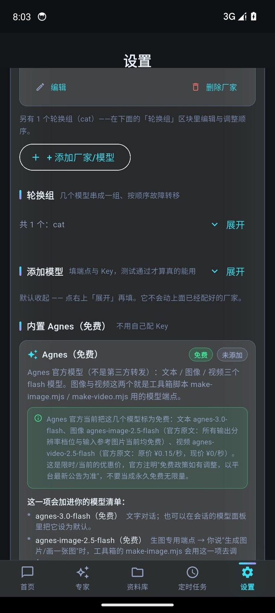
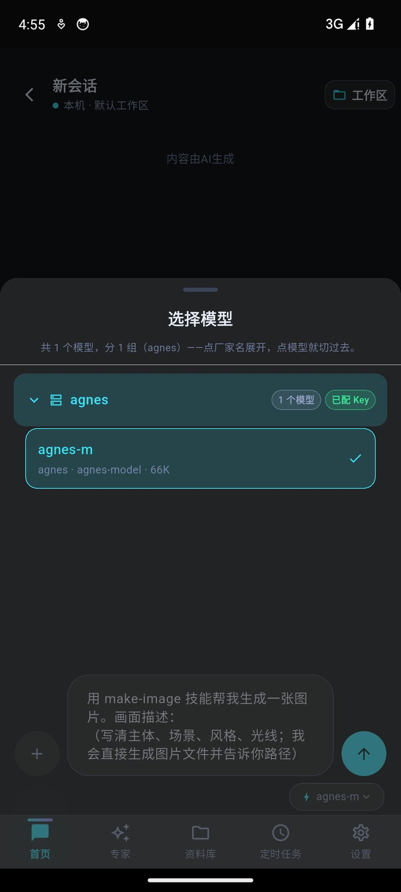
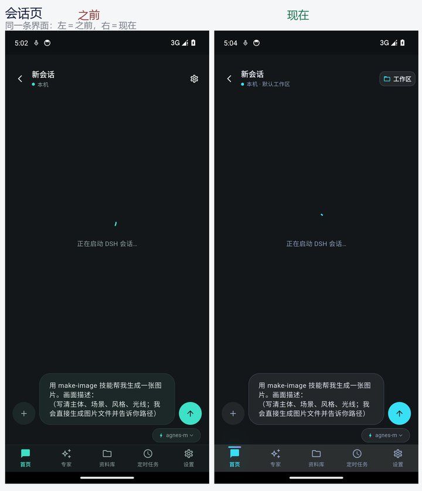
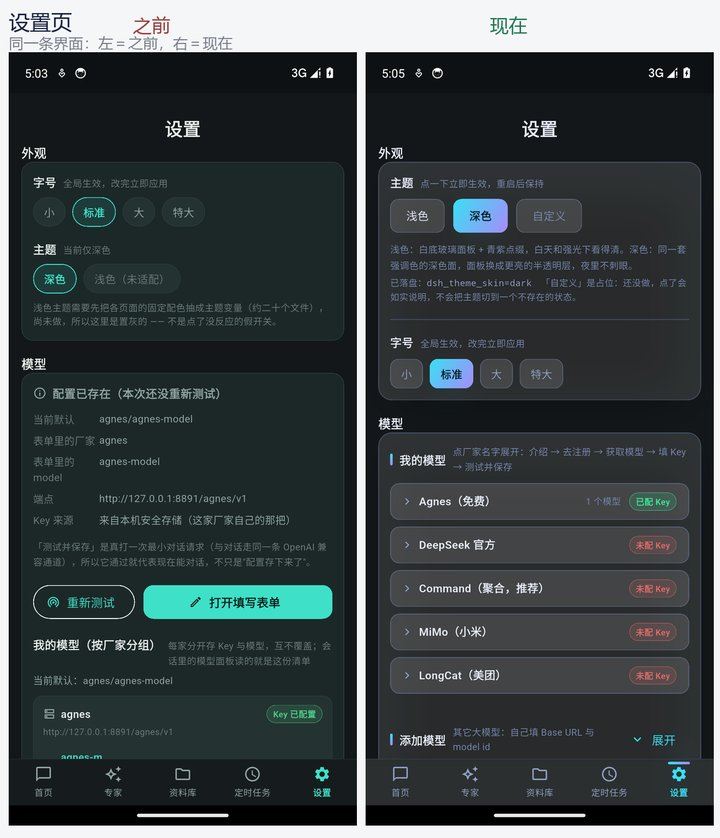
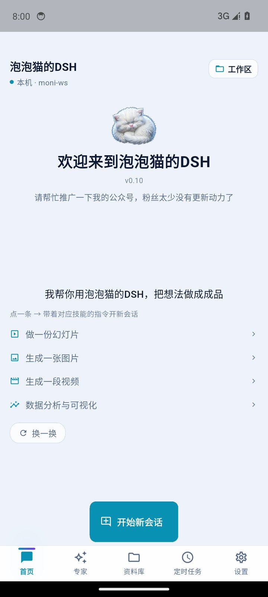
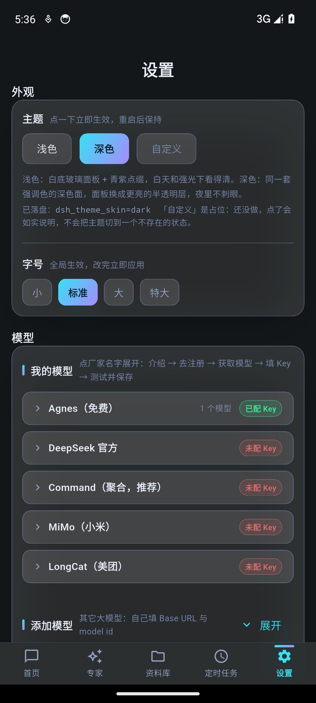
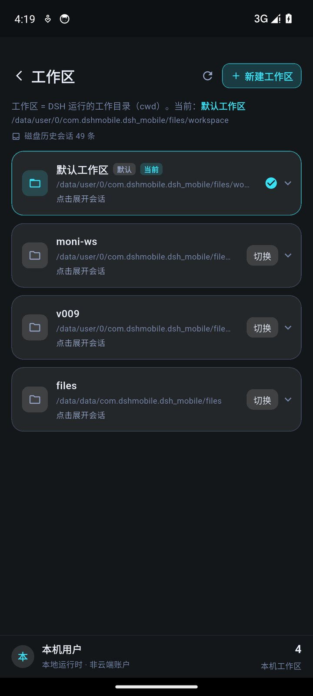
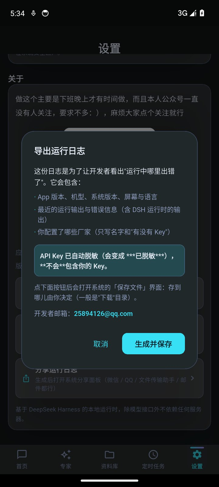

# paopaocat deepseek harness-mobile

> 手机上的 DeepSeek Harness —— 把整套 DSH 运行时装进 Android，完整能力、完整文件系统，全部在你自己的手机里。除了调模型那一步，不依赖任何服务器。



## 它是什么

DSH 是一套能在本机跑起来的 AI Agent 运行时，能读写文件、执行任务、调用工具、维护多轮上下文。

这个 App 做的是：**把一整套 DSH 运行时原封不动塞进 Android 应用**——内嵌 Node 运行时与全部依赖（`libnode.so` 49MB + `dsh-runtime.zip` 157MB，内核 `@deepseek-ai/dsh 0.1.7-rc.2`），首次启动自动解压到应用私有目录，之后**完全离线运行**（只有与模型对话时才联网）。

它不是网页套壳，也不是远程桌面。关掉网络，它的界面、历史、文件都还在你自己的手机上。

- 包体：`paopaocat-preview-0.14-arm64-v8a.apk` · 188MB · arm64-v8a · minSdk 24
- 内核：Flutter + Node · 321 名专家 / 22 分区 · 12 个技能（make-image/video/slides 等 + android-exec-shim）
- 隐私：API Key 只存 Android Keystore，会话与产出在私有目录，执行前需你确认

## 安装

- 真机 arm64，允许安装未知应用
- 安装后首次启动会解压运行时（约 30 秒），之后即可离线使用
- 仅 arm64-v8a 单架构包，x86/armeabi 设备不兼容

```sh
# 校包体
sha256sum paopaocat-preview-0.14-arm64-v8a.apk
# 预期: d5448afcc4d555ad7530e76dba16d78a301b4df89d8b4d4412a940ca77505cad
```

## 快速开始

1. **配模型**：设置 → 选 DeepSeek 官方 / Command / LongCat / MiMo（端点已预填）→ 填 Key → **获取模型** → 勾选 → **测试并保存**（会真打一次最小对话，通了才显示已就绪）
2. **开会话**：首页 **开始新会话** → 输入需求 → 看流式回显、工具调用卡片、产物卡片；可 **中断/继续**
3. **用专家与技能**：专家中心开需要的专家（开关真写运行时配置）→ 回会话提需求；也可直接让模型“帮我生成一个技能”
4. **收文件**：会话产出自动进 **资料库** → **工作区** 多目录并行；需定时则建任务（每天/工作日/每周/仅一次），到点自跑（依赖常驻通知，受国产 ROM 省电策略影响可能标“已错过”）
5. **附件**：拍照（系统相机→私有目录）/ 相册选图视频 / 任意文件（给真实路径可被模型读取）/ 语音（调系统识别，质量取决于本机服务）

## 0.14 预览版更新（6 个版本 · 36 条）

详见 [`紧急更新：6个版本36条的0.14版本泡泡猫DSH手机版.html`](../../dsh/attachments/v1/files/34/3419de2ce754de1c458c00dd52f546005f89c2da1fb0895e92f30cd6a7f5d43f/) 与 [`公众号-泡泡猫DSH预览版.md`](../../dsh/attachments/v1/files/6c/6cc4d54a3001c2edade96793444f218afb7c024c29bb59638ae4891b5ec5fb68/)：

- **生成文件可用 (5条)**：修 `spawn bash ENOENT`、可直接调工具箱脚本、PPT 真出 `.pptx`、网页产物直接渲染、支持系统分享
- **产物只出真文件 (1条)**：文件真实存在 + 本次会话写出 双门槛，拦截示例占位名与旧文件混入
- **模型与 Key (13条)**、**界面 (7条)**、**会话与日常 (8条)**、**语音 (2条，含未修完说明)**

> 语音识别：本地 239MB int8 模型 + Android bionic 不兼容，暂无法内置；已改走设备端离线识别优先 + 权限精细化。

## 已知限制

- 浅色主题仍置灰（配色未抽变量）
- 后台常驻通知依赖系统省电策略，部分国产 ROM 会杀进程，错过的任务会标“已错过”
- 仅 arm64-v8a，单包 188MB
- 深色主题唯一

## 截图

| | | | |
|---|---|---|---|
|  |  |  |  |
|  |  |  |  |

*本文所有截图均来自真机实拍，未做美化（由 `紧急更新.html` 内 10 张 base64 导出，节选 8 张 720 系列作商店主图）。*

## 相关

- 桌面版：`dshpack-017`（Win/macOS）
- 预览图文稿：`公众号-泡泡猫DSH预览版.md` / `紧急更新.html`
- 反馈：GitHub Issues（仓库建好后）

## License

MIT
